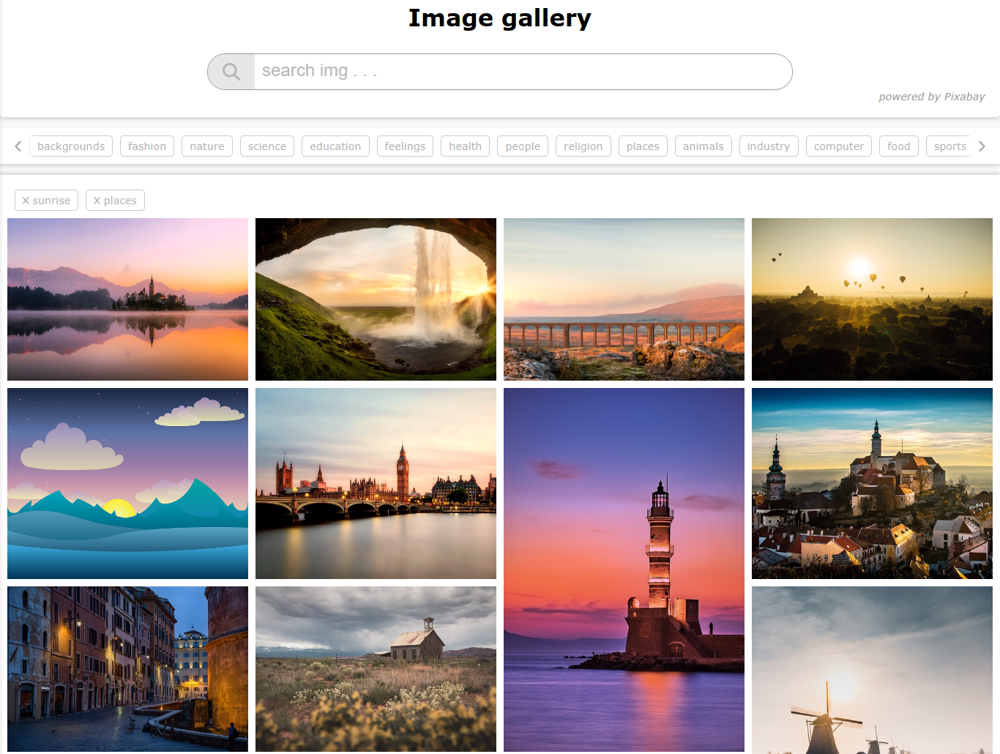

# Image Gallery App

Welcome to the Image Gallery App! This web application allows you to explore and search for images using the Pixabay API. You can view, save, and manage your favorite images in a beautiful gallery interface.

**Note: This app is currently under construction. Feel free to explore its features and provide feedback. Contributions from developers are welcome to help improve this project.**

## Features

1. **Image Search:** Search for images by entering keywords in the search bar. Retrieve a collection of relevant images from the Pixabay API.

2. **Image Display:** View search results in a clean and user-friendly gallery layout, making it easy to browse through images.

3. **Image Details:** Click on an image to view its details, including the image itself, the photographer's name, and the image's resolution.

4. **Favorites:** Save your favorite images by clicking the "Add to Favorites" button. You can access your saved favorites in the Favorites section.

5. **Favorites Management:** In the Favorites section, you can remove images from your favorites list by clicking the "Remove" button.

## Usage

Using the Image Gallery App is straightforward:

1. **Search for Images:**
   - Enter keywords in the search bar and press Enter or click the search icon.
   - Scroll through the search results to explore images.

2. **View Image Details:**
   - Click on an image in the gallery to view its details.

3. **Add to Favorites:**
   - While viewing image details, click the "Add to Favorites" button to save the image to your favorites list.

4. **Download img**
   - Click on download icon on img to download img

## Screenshots

**Note: Include screenshot showcasing your app's interface here.**

## Technologies Used

- Vanilla JavaScript: The app is built entirely using vanilla JavaScript, demonstrating core web technologies.

- HTML & CSS: To create the user interface and apply styles for an attractive presentation.

- Pixabay API: To fetch images and their details for display.

## Contributing

Contributions to this project are encouraged! If you have ideas for improvements, new features, or if you encounter any issues, please follow these steps to contribute:

1. Fork this repository.
2. Create a new branch for your changes: `git checkout -b feature-name`
3. Implement your changes and commit them: `git commit -m "Description of your changes"`
4. Push your changes to your fork: `git push origin feature-name`
5. Create a pull request to this repository.

Please ensure that your code adheres to best practices and includes clear documentation for new features.

## License

This project is licensed under the [MIT License](./LICENSE). You are welcome to use, modify, and distribute this application for your own purposes.

Enjoy exploring and managing your favorite images with the Image Gallery App!
